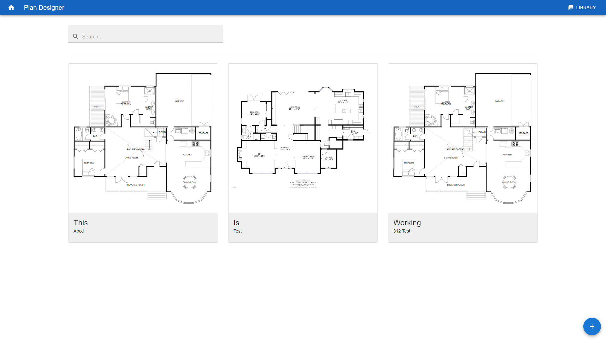
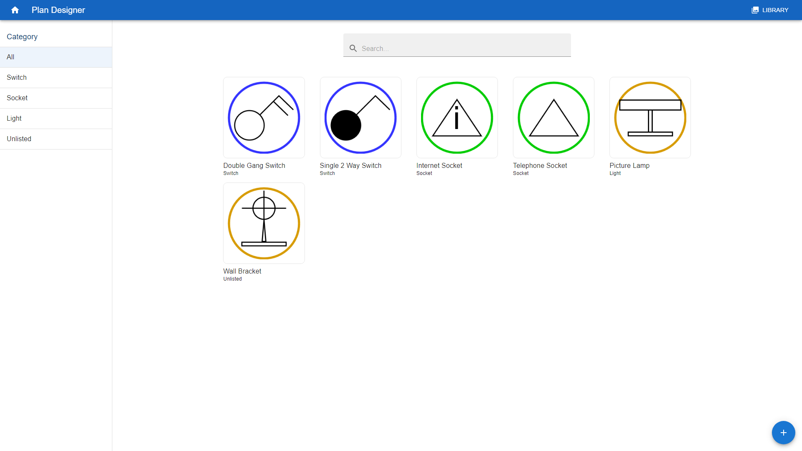
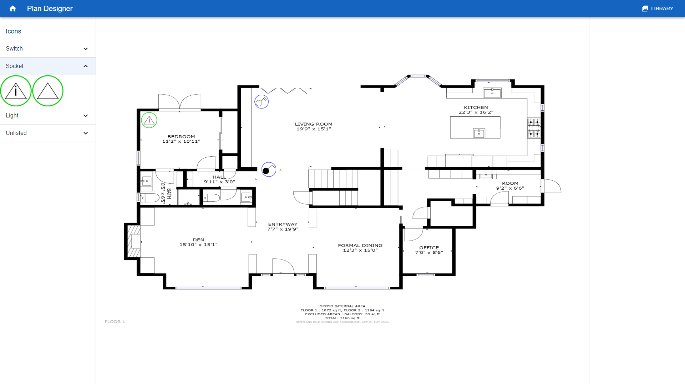

## Project Name & Functionality

Plan Designer

An application that allow users to upload floor maps and electrical 
icons to create electrical floor plans.

## Frameworks and Libraries
Reactjs, MaterialUI and Fabricjs.

## Demo on Netlify

[Plan designer App](https://plan-designer.netlify.app/).

## Project Status
* Editor Functions (WIP)
    - Updating the Canvas background with the floor map (limited functionality)
    - Placing icons on to the canvas (limited functionality)
    - Drawing on to the canvas (WIP)
    - Undo & Redo (WIP)
    - Saving to the database (WIP)

* Firebase (WIP)
    - Uploading & deleting projects :heavy_check_mark:
    - Uploading & deleting icons :heavy_check_mark:
    - Prevent multiple requests / restrict server calls :x:

## Project Screenshots
# Dashboard Page

# Library page

# Editor Page 

## Installation Guide

Clone this repository

Install the dependencies:
`npm install`

Requires firebase connection

Start the dev server:
`npm start`

Access the app:
`localhost:3000/`

